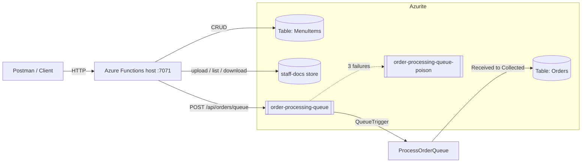

# CoffeeNChill Canteen Management System

Cloud-enabled microservices backend for the CoffeeNChill campus canteen (CLDV6212 PoE).

| Part | What it adds | Docker image tag |
|------|--------------|------------------|
| 1 | Azure Functions + Azure Tables (menu) + file storage (staff documents) + standalone Docker | `coffeenchill-functions:v1.0`, `coffeenchill-azurite:v1.0` |
| 2 | Queue-triggered order processing + Docker Compose | `coffeenchill-functions:v2.0` |

**Videos (unlisted YouTube):**
- Part 1: `PASTE_PART_1_LINK_HERE`
- Part 2: `PASTE_PART_2_LINK_HERE`

**Docker Hub:** `https://hub.docker.com/u/YOURDOCKERUSER`

---

## Architecture



## Repository layout

```
CoffeeNChill/
  docker-compose.yml              # Part 2: one-command startup (images from Docker Hub)
  azurite/Dockerfile              # coffeenchill-azurite image
  CoffeeNChill.Functions/         # Azure Functions project (.NET 8 isolated worker)
    Dockerfile                    # multi-stage build
    Functions/                    # HTTP + queue-triggered functions
    Models/ Services/ Helpers/    # DTOs, storage repositories, validation
    host.json  local.settings.json
  docs/
    CoffeeNChill.part1.postman_collection.json
    CoffeeNChill.postman_collection.json      # Part 1 + Part 2
    CoffeeNChill.postman_environment.json
    samples/                      # files used by the upload tests
```

## API reference

| Method | Route | Purpose | Success |
|--------|-------|---------|---------|
| POST | `/api/menu` | Create menu item | 201 |
| GET | `/api/menu` | All items | 200 |
| GET | `/api/menu/category/{category}` | Items in a category (PartitionKey) | 200 |
| PUT | `/api/menu/{category}/{id}` | Update name / description / price / availability | 200 |
| DELETE | `/api/menu/{category}/{id}` | Delete item | 204 |
| POST | `/api/documents/upload` | Upload (multipart/form-data, field `file`) | 201 |
| GET | `/api/documents` | List name, size, last modified | 200 |
| GET | `/api/documents/download/{fileName}` | Stream a document | 200 |
| POST | `/api/orders/queue` | Validate and queue an order | 202 |
| GET | `/api/orders/{orderDate}/{orderId}` | Order status from Orders table | 200 |
| GET | `/api/orders?date=yyyy-MM-dd` | List orders | 200 |
| POST | `/api/orders/queue/poison-test` | DEMO: queue a broken message | 202 |

Errors use one shape: `{ "message": "...", "errors": ["..."] }` with 400 / 404 / 409 / 413 / 415 / 503 as appropriate.

Order message placed on `order-processing-queue`:

```json
{
  "OrderId": "ORD-2026-8801",
  "CustomerName": "Jane Smith",
  "SelectedItemSKUs": ["COF-001", "PAS-104"],
  "TotalPrice": 65.00,
  "OrderTimestamp": "2026-10-12T10:15:00Z"
}
```

---

## Local setup (no Docker for the Functions app)

Requirements: .NET 8 SDK, Azure Functions Core Tools v4, Docker Desktop, Postman.

1. Start Azurite in its own container:
   ```bash
   docker run -d --name azurite -p 10000:10000 -p 10001:10001 -p 10002:10002 \
     mcr.microsoft.com/azure-storage/azurite \
     azurite --blobHost 0.0.0.0 --queueHost 0.0.0.0 --tableHost 0.0.0.0 --loose --skipApiVersionCheck
   ```
2. Run the functions:
   ```bash
   cd CoffeeNChill.Functions
   func start
   ```
   `local.settings.json` already has `AzureWebJobsStorage = UseDevelopmentStorage=true`.
3. Import `docs/CoffeeNChill.postman_environment.json` and a collection from `/docs`, then run it.

> Azurite port map: **10000 = Blob, 10001 = Queue, 10002 = Table.**

### About Azure Files and Azurite

Azurite does not emulate Azure Files. The document functions use an `IDocumentStore` abstraction:

| `DocumentStorageMode` | Where files go | When to use |
|-----------------------|----------------|-------------|
| `Blob` (default) | Blob container named `staff-docs` in Azurite | Local development and the Docker demos |
| `FileShare` | Real Azure Files share named `staff-docs` | Set `FileShareConnectionString` to a real storage account |

The HTTP contract is identical in both modes, so the same Postman tests pass either way.

---

## Part 1: standalone Docker (no Compose)

Replace `YOURDOCKERUSER` with the Docker Hub username.

```bash
# 1. Build and push the Functions image
cd CoffeeNChill.Functions
docker build -t YOURDOCKERUSER/coffeenchill-functions:v1.0 .
docker push  YOURDOCKERUSER/coffeenchill-functions:v1.0

# 2. Build and push the Azurite image
cd ../azurite
docker build -t YOURDOCKERUSER/coffeenchill-azurite:v1.0 .
docker push  YOURDOCKERUSER/coffeenchill-azurite:v1.0

# 3. Run them as separate containers on a shared network
docker network create coffee-net

docker run -d --name azurite --network coffee-net \
  -p 10000:10000 -p 10001:10001 -p 10002:10002 \
  YOURDOCKERUSER/coffeenchill-azurite:v1.0

docker run -d --name functions --network coffee-net -p 7071:80 \
  -e FUNCTIONS_WORKER_RUNTIME=dotnet-isolated \
  -e AzureWebJobsStorage="DefaultEndpointsProtocol=http;AccountName=devstoreaccount1;AccountKey=Eby8vdM02xNOcqFlqUwJPLlmEtlCDXJ1OUzFT50uSRZ6IFsuFq2UVErCz4I6tq/K1SZFPTOtr/KBHBeksoGMGw==;BlobEndpoint=http://azurite:10000/devstoreaccount1;QueueEndpoint=http://azurite:10001/devstoreaccount1;TableEndpoint=http://azurite:10002/devstoreaccount1;" \
  YOURDOCKERUSER/coffeenchill-functions:v1.0
```

Why not `UseDevelopmentStorage=true` inside the container? That string means "localhost", which inside the Functions container is the container itself, not Azurite. On a shared Docker network the connection string must point at the Azurite container name (`azurite`).

## Part 2: Docker Compose

1. Build and push the v2.0 image:
   ```bash
   cd CoffeeNChill.Functions
   docker build -t YOURDOCKERUSER/coffeenchill-functions:v2.0 .
   docker push  YOURDOCKERUSER/coffeenchill-functions:v2.0
   ```
2. Edit `docker-compose.yml`: replace `YOURDOCKERUSER` (2 places).
3. Start everything with one command from the repo root:
   ```bash
   docker compose up
   ```
   The compose file uses `image:` only (no `build:`), a custom bridge network (`coffee-net`) and a named volume (`azurite-data`).
4. Stop: `docker compose down` (add `-v` to wipe Azurite data).

## Testing with Postman

- Import `docs/CoffeeNChill.postman_environment.json` and `docs/CoffeeNChill.postman_collection.json`; select the **CoffeeNChill Local** environment.
- Upload requests: if Postman cannot find a sample file, re-select it from `docs/samples/` in the request's Body tab.
- Run the folders in order. The order-status requests wait (about 2 s, 8 s, 20 s) so the status moves Received, Preparing, Ready, Collected. Set `ORDER_STATUS_DELAY_SECONDS` lower for a faster demo.
- To see the poison queue, send **Queue a deliberately broken message**, then open Azure Storage Explorer and look at `order-processing-queue-poison` after about 30 seconds.

---

## Changelog

### v2.0 (Part 2)
- Added `POST /api/orders/queue` producer: validation, server timestamp, JSON payload, Base64 encoding, 503 on queue failure.
- Added `ProcessOrderQueue` (`[QueueTrigger]`): writes to the `Orders` table and advances Received, Preparing, Ready, Collected.
- Added poison-queue handling (`maxDequeueCount = 3`) and a demo endpoint to trigger it.
- Added `GET /api/orders/{date}/{id}` and `GET /api/orders` for status checks.
- Added `docker-compose.yml` (Azurite + Functions, images pulled from Docker Hub, bridge network, data volume).
- Extended the Postman collection with queue and status tests.

### v1.0 (Part 1)
- Menu CRUD and category filtering against the `MenuItems` table.
- Staff document upload / list / download.
- Dockerfile (multi-stage), Azurite image, standalone `docker run` instructions, Postman collection.

---

## Team contributions

Edit this table so it matches what each person really did.

| Member | Part 1 | Part 2 |
|--------|--------|--------|
| Ntando | Menu CRUD functions and validation | Queue producer (`/api/orders/queue`) |
| Mandlakazi | Staff document functions | `ProcessOrderQueue`, Orders table, poison queue |
| Nikshay | Dockerfiles, Docker Hub, standalone `docker run` | `docker-compose.yml`, v2.0 image |
| Sena | Postman collection, README, video | Postman updates, changelog, video, Git workflow |

## AI usage disclosure

State here which AI tools were used, for which tasks (for example planning, code scaffolding, proofreading), and what each member reviewed, tested and changed themselves.
